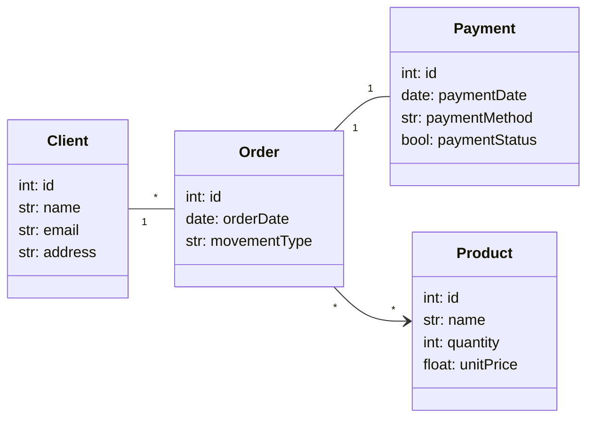

# Trabalho Persistência

## Alunos
- Leonardo Martins de Loiola - 553762
- Lucas Cavalcante Torres - 557156
- Roberto Alexandre da Silva Sousa Junior - 475223

## Descrição do Projeto
Este projeto consiste em um sistema de gerenciamento de vendas e produtos, implementado com FastAPI e SQLModel. Ele contempla operações de CRUD para clientes, pedidos, produtos e pagamentos, além de consultas mais avançadas com filtros e agregações.

O projeto utiliza boas práticas recomendadas pela comunidade FastAPI para aplicações maiores, seguindo o modelo de arquitetura baseado em file-type, conforme descrito na documentação oficial: [FastAPI - Bigger Applications](https://fastapi.tiangolo.com/tutorial/bigger-applications/).

Além disso, algumas funcionalidades extras foram implementadas, como:
- Busca por nome de clientes e produtos com filtros de string.
- Contagem de pedidos por produto.
- Busca de pedidos por cliente.
- Consultas com carregamento de relacionamentos usando `selectinload` para otimização.
- Paginação em endpoints de listagem.
- Integração com múltiplos bancos de dados (SQLite para desenvolvimento e Neon para o banco remoto).
- Migrações de banco de dados utilizando Alembic.
- Utilização do UV como ambiente virtual e gerenciador de dependências.

## Estrutura do Projeto
O projeto está dividido em camadas seguindo o padrão recomendado:
- `models`: Definição das entidades do banco de dados.
- `schemas`: Modelos de leitura e criação para validação.
- `crud`: Operações de banco de dados (inserção, atualização, deleção, consultas).
- `services`: Regras de negócio e processamento de dados.
- `routers`: Endpoints da API organizados por entidade.
- `db`: Configuração e conexão com o banco de dados.
- `divisao_tarefas.txt`: Arquivo que descreve a divisão de responsabilidades entre os integrantes do grupo.


## Esquema de Banco


## Instruções para Uso

Este projeto utiliza o **[uv](https://github.com/astral-sh/uv)** para gerenciamento de dependências e ambiente virtual.

### Pré-requisitos
Certifique-se de ter o `uv` instalado em sua máquina.

### Passo a Passo

1. **Instalar Dependências**
   Dentro da pasta do projeto, execute o comando abaixo. O `uv` lerá o arquivo `pyproject.toml`, criará automaticamente o ambiente virtual (`.venv`) e instalará todas as bibliotecas necessárias.

   ```bash
   uv sync
   ```

2. Ativar o Ambiente Virtual Após a sincronização, você precisa ativar o ambiente para rodar o projeto:

    ```bash
    source .venv/bin/activate
    ```
3. Para rodar a aplicação, faça:
```bash
    uvicorn app.main:app --reload
```