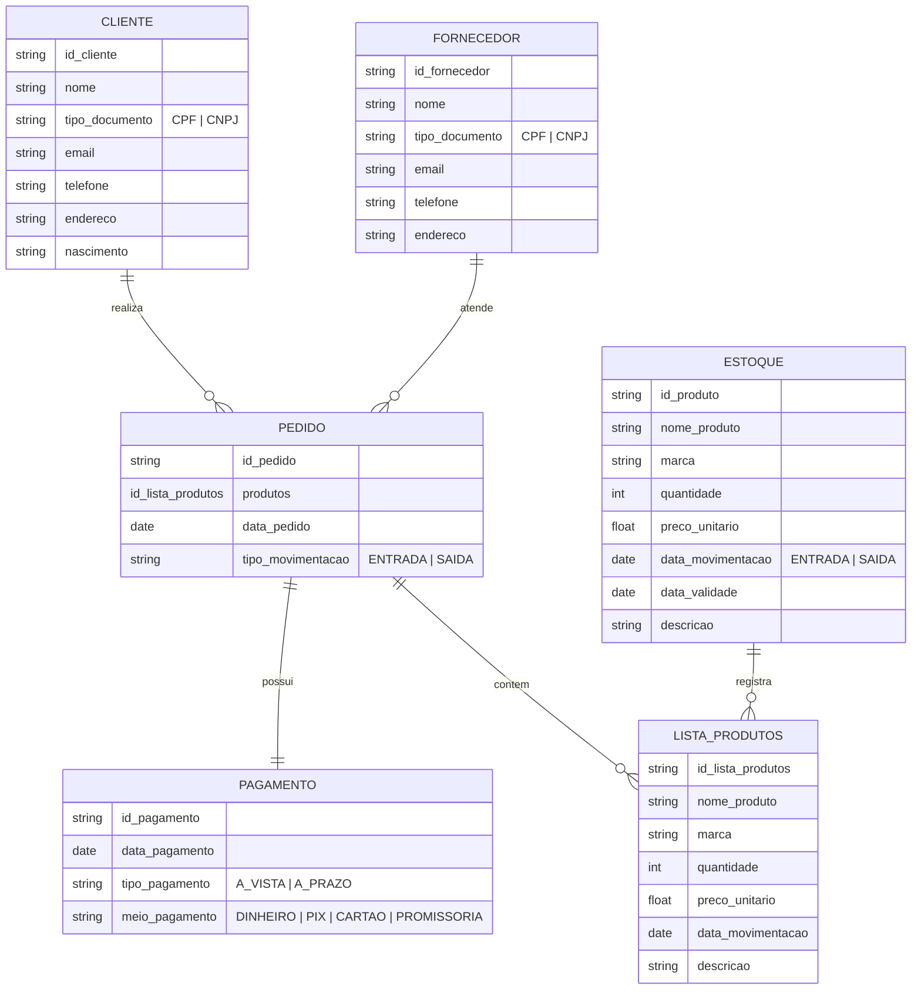

# Persistencia

## Alunos: 
- Leonardo Martins de Loiola - 553762
- Lucas Cavalcante Torres - 557156
- Roberto Alexandre da Silva Sousa Junior - 475223

## Instruções para Uso

- Seguir guia do UV([https://uv.pydevtools.com/])
- source .venv/bin/activate
- uv add [nome da lib]

## Relações

- Produto
- Venda
- Categoria
- Cliente
- Pedido
- Pagamento
- Fornecedor
- Compra
- Item Compra
- Item Pedido

##Diagramas Mermaid

# Querys
## Clientes
- Consultar_Cliente_Nome
- Consultar_Cliente_ID
- Consultar_Cliente_Doc
- Consultar_Cliente_Por_Numero_Pedido
- Consultar_Cliente_Por_Endereco

## Fornecedores
- Consultar_Fornecedor_Por_ID
- Consultar_Fornecedor_Por_Nome
- Consultar_Fornecedor_Por_Doc
- Consultar_Fornecedor_Por_Endereco
- Consultar_Fornecedor_Por_Pedido

## Pedidos
- Consultuar_Pedido_Endereco_Entrega
- Consutlar_Pedido_ID
- Consultar_Pedido_Data
- Consultar_Pedido_Meio_Pagamento

## Pagamentos
- Consultar_Pagamento_Data
- Consultar_Pagamento_Cliente
- Consultar_Pagamento_Fornecedor
- Consultar_Pagamento_Por_Pedido

## Estoque
- Consultar_Data_Validade_Proxima
- Consultar_Baixa_Quantidade_Produto(trigger para alerta)
- Consultar_Produto_Por_Nome
- Consultar_Produto_Por_ID
- Consutlar_Produto_Por_Fornecedor
- Consutlar_Produto_Por_Marca
- Consutlar_Produto_Por_Descricao

