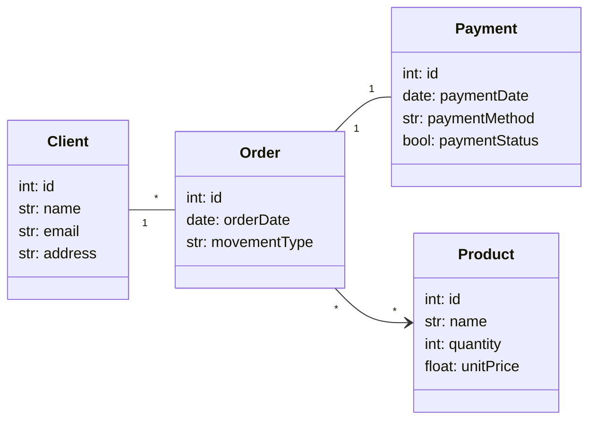

# Trabalho PErsistencia

## Alunos: 
- Leonardo Martins de Loiola - 553762
- Lucas Cavalcante Torres - 557156
- Roberto Alexandre da Silva Sousa Junior - 475223

## Instruções para Uso

- Seguir guia do UV([https://uv.pydevtools.com/])
- source .venv/bin/activate
- uv add [nome da lib]

## Relações

- Produto
- Venda
- Categoria
- Cliente
- Pedido
- Pagamento
- Fornecedor
- Compra
- Item Compra
- Item Pedido

## Diagramas Mermaid

