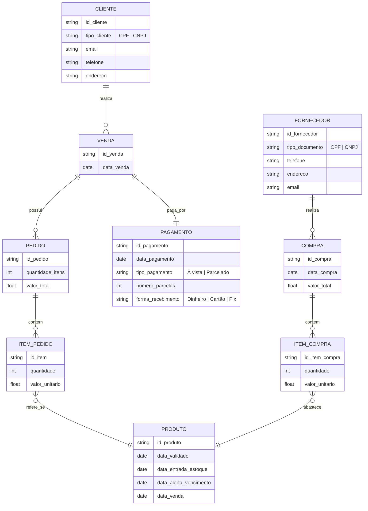

# Persistencia

## Alunos: 
> Leonardo Martins de Loiola - 553762
> Lucas Cavalcante Torres - 557156
> Roberto Alexandre da Silva Sousa Junior - 475223

## Instruções para Uso

- Seguir guia do UV([https://uv.pydevtools.com/])
- source .venv/bin/activate
- uv add [nome da lib]

## Relações

- Produto
- Venda
- Categoria
- Cliente
- Pedido
- Pagamento
- Fornecedor
- Compra
- Item Compra
- Item Pedido

##Diagramas Mermaid

# Querys
## Clientes
- CONSULTAR_CLIENTES
- CONSULTAR_CLIENTE_POR_ID
- CONSULTAR_CLIENTES_POR_TIPO

## Produtos
- CONSULTAR_PRODUTOS
- CONSULTAR_PRODUTO_POR_ID
- CONSULTAR_PRODUTOS_COM_ESTOQUE_BAIXO
- CONSULTAR_PRODUTOS_PROXIMOS_DO_VENCIMENTO 

## Fornecedores
- CONSULTAR_FORNECEDORES
- CONSULTAR_FORNECEDOR_POR_ID

## Vendas
- CONSULTAR_VENDAS
- CONSULTAR_VENDAS_POR_PERIODO
- CONSULTAR_VENDAS_POR_CLIENTE
- CONSULTAR_VENDAS_POR_FORMA_PAGAMENTO

## Pedidos
- CONSULTAR_PEDIDOS
- CONSULTAR_PEDIDOS_POR_VENDA

## Itens em Pedido
- CONSULTAR_ITENS_PEDIDO_POR_PEDIDO

## Pagamentos
- CONSULTAR_PAGAMENTOS
- CONSULTAR_PAGAMENTOS_PARCELADOS
- CONSULTAR_PAGAMENTOS_A_VISTA

## Compras
- CONSULTAR_COMPRAS
- CONSULTAR_COMPRAS_POR_FORNECEDOR
- CONSULTAR_COMPRAS_POR_PERIODO

## Itens em Compra
- CONSULTAR_ITENS_COMPRA_POR_COMPRA

## Estoque
- CONSULTAR_MOVIMENTACAO_ESTOQUE
