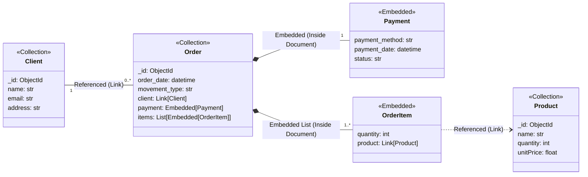

# Persistence Project: API with FastAPI and MongoDB

## Students
- Leonardo Martins de Loiola - 553762
- Lucas Cavalcante Torres - 557156
- Roberto Alexandre da Silva Sousa Junior - 475223

## Project Description
This project consists of a sales and product management system, migrated from a relational architecture to **NoSQL**, using **FastAPI** and **MongoDB** (via **Beanie ODM**). It includes complete CRUD operations for clients, orders, and products, as well as advanced queries using native MongoDB features.

The project follows asynchronous development best practices and modular architecture, ensuring performance and scalability.

### Implemented Features
- **NoSQL Technology:** Data persistence using MongoDB and Motor (asynchronous driver).
- **Beanie ODM:** Object-document mapping for data validation and structuring.
- **Advanced Queries:**
    - Text search by **Regex** (Case-insensitive) for clients and products.
    - **Aggregation Pipelines** for statistics (e.g.: item count per order, total orders per client).
    - Temporal filters (queries by year).
- **Relationships:**
    - Use of **Document Links** (References) to relate Orders to Clients and Products.
    - Use of **Embedded Documents** for Payments and Order Items, optimizing reading.
    - Smart loading of relationships with `fetch_links=True`.
- **Pagination:** Natively implemented with MongoDB's `skip` and `limit` in all listing endpoints.
- **Dependency Management:** Use of **uv** for agile virtual environment management.

Project repository link for more details: [repository](https://github.com/DevJuniorss/EstoquePersistido)

## Project Structure
The project is organized in layers to facilitate maintenance:
- `models`: Definition of Documents (`Client`, `Product`, `Order`) and sub-documents (`Payment`, `OrderItem`).
- `crud`: Direct database access layer (Beanie queries, aggregates, filters).
- `services`: Business logic and data orchestration.
- `routers`: API endpoints (Controllers).
- `db`: MongoDB Atlas or Local connection configuration.

## Database Schema (NoSQL)

In this non-relational model, we use **Collections** and **Documents**. The diagram below illustrates how data is structured and related. Note that `Payment` and `OrderItem` live inside `Order`.


```mermaid
classDiagram
    direction LR

    class Client {
        <<Collection>>
        _id: ObjectId
        name: str
        email: str
        address: str
    }

    class Product {
        <<Collection>>
        _id: ObjectId
        name: str
        quantity: int
        unitPrice: float
    }

    class Order {
        <<Collection>>
        _id: ObjectId
        order_date: datetime
        movement_type: str
        client: Link[Client]
        payment: Embedded[Payment]
        items: List[Embedded[OrderItem]]
    }

    class Payment {
        <<Embedded>>
        payment_method: str
        payment_date: datetime
        status: str
    }

    class OrderItem {
        <<Embedded>>
        quantity: int
        product: Link[Product]
    }

    %% NOSQL RELATIONSHIPS
    Client "1" -- "0..*" Order : Referenced (Link)
    Order *-- "1" Payment : Embedded (Inside Document)
    Order *-- "1..*" OrderItem : Embedded List (Inside Document)
    OrderItem ..> Product : Referenced (Link)
```
## Usage Instructions

This project uses **Docker** to containerize the database and **[uv](https://github.com/astral-sh/uv)** for agile dependency and Python virtual environment management.

### Prerequisites
Make sure you have installed on your machine:
- **Docker & Docker Compose**
- **uv** (Python package manager)

### Step by Step

1. **Start the Database**
   At the project root, run the command below to start containers (MongoDB and Mongo Express) in the background:
   ```bash
   docker compose up -d
   ```
2. **Install dependencies**
    ```bash
    uv sync
    ```
3. **Populate Local Database**
    ```bash
    uv run import_json.py
    ```
4. **Run Application**
    ```bash
    uv run uvicorn app.main:app --reload
    ```

